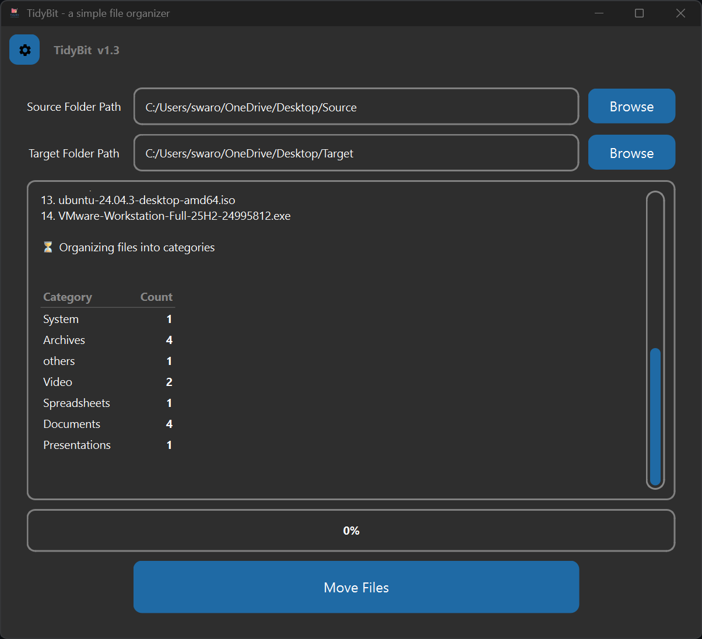
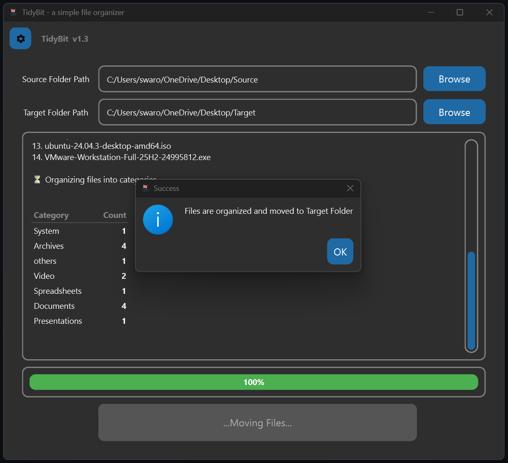
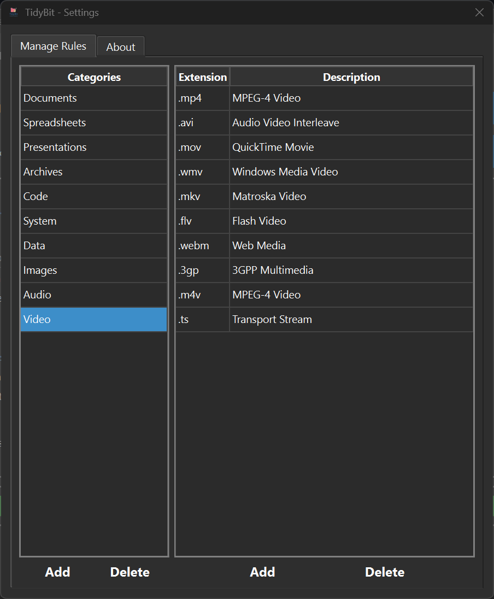
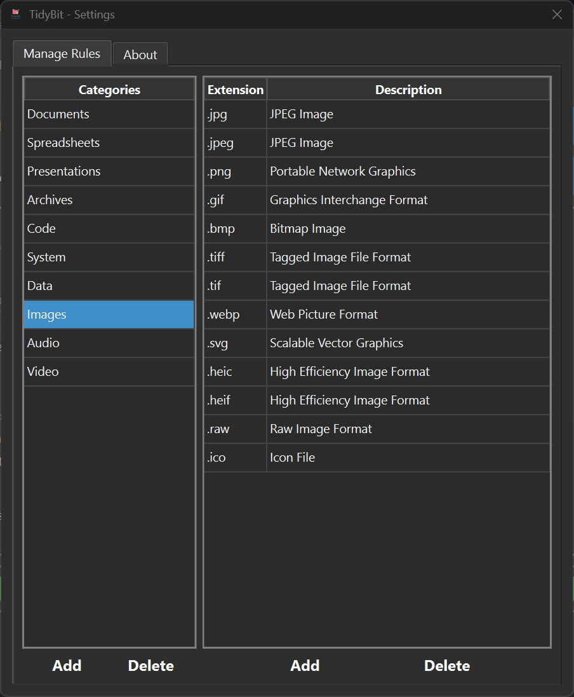
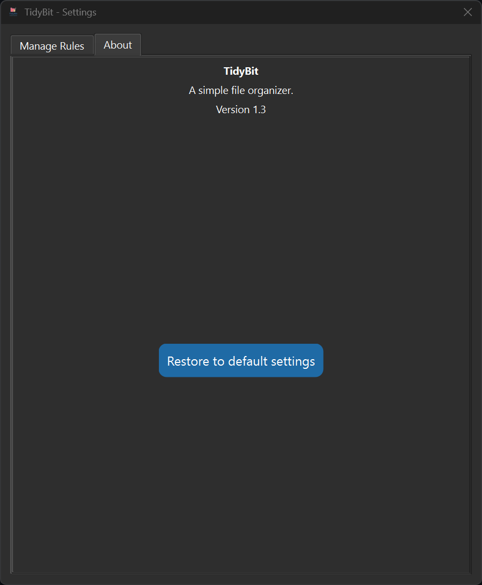

<p align="center">
  
</p>

# TidyBit - a simple file organizer


[](https://snapcraft.io/tidybit)

## 📹 Video Demo:  Watch on Youtube

#### 🪟 Windows - [Windows Demo](https://www.youtube.com/watch?v=cMDjuckLr0U)

#### 🐧 Linux - [Linux Demo](https://www.youtube.com/watch?v=_gJDg9AWWsk)

## 📥 Download

Choose your preferred way to install **TidyBit**:

---

### 🪟 Windows (Recommended)
[](https://apps.microsoft.com/store/detail/9PGJQVC129C0)

✔ Automatic updates  
✔ Recommended for most users  

---

### 🐧 Linux (Snap)
[](https://snapcraft.io/tidybit)

✔ Easy installation  
✔ Auto updates via Snap  

---

### 📦 Direct Download (GitHub Releases)
[](https://github.com/Veda-Swaroop/TidyBit/releases)

#### Windows
1. Download the `.exe` setup file  
2. Run the installer and follow the instructions  

#### Linux (AppImage)
1. Download the `.AppImage` file  
2. Right-click → **Properties → Permissions**  
3. Enable **“Allow executing file as program”**  
4. Double-click to run  

> 💡 Tip: Store versions are recommended for automatic updates and better system integration.


**Note**: If unable to run app on Linux, It might be due to **FUSE (Filesystem in Userspace) version**.
Latest Ubuntu, Debian and other Linux distros may require FUSE installation.
Please check this page for instructions:  [AppImage - FUSE](https://github.com/AppImage/AppImageKit/wiki/FUSE)

## 📷 Screenshots:

<p align="center">
  
  
  
</p>
<p align="center">
  
  
  
</p>


## 📝 Description: 
### TidyBit is an easy-to-use file organizer app. It helps you organize messy files piled up in folders. It comes with commonly used file types and file categories as rules. These rules define what files to identify and organize. The pre-defined rules are fully customizable. Add new rules. Modify or delete existing rules. An option to reset and restore to default rules is available in settings. 
**Note**: 
1. The app works only on files from source location and not on sub-directories. If there are sub-directories and other folders within source location, the app will ignore them. 
2. Please check **Settings** for pre-defined file types and categories.


## 📖 Introduction

Our computers often become cluttered with files scattered across Downloads, Desktop, or within external drives. Manually sorting them is tedious and time‑consuming. **TidyBit** was built to solve this problem with a clean, beginner‑friendly interface.

The app functions in just four simple steps:
1. **Validation** – Check source and target folder paths  
2. **Fetch Files** – Display files from the source folder  
3. **Organize Files** – Identify and categorize files based on rules defined in settings (documents, images, videos, code, etc.)  
4. **Move Files** – Create subfolders and move files accordingly  

With its simple GUI and clear information display, TidyBit makes file organization effortless and efficient.


## ✨ Features
- Easy to use UI
- Information display at each step of operation
- Can handle large sized files and files on external drives
- Progress bar displays real time file operation progress
- Comes with pre-defned and fully customizable rules
- Add, modify or delete rules
- File organization based on rules 
- Step-by-step workflow:
  1. Validation
  2. Fetching Files
  3. Organizing Files
  4. Moving Files
- Option to reset and restore to default rules
- Clear error handling and user messages 
- Supports most commonly used file types by default


## ⚙️ Installation (Running from Source)
If you are a developer or want to run the Python script directly:

1. Clone the repository:
   ```bash
   https://github.com/Veda-Swaroop/TidyBit.git
   pip install -r requirements.txt
   python main.py

## 🚀 Usage

Using **TidyBit** is straightforward. The interface guides you through four clear steps:

1. **Select Folders**  
   - Choose a **source folder** (where cluttered files are located).  
   - Choose a **target folder** (where organized files will be moved).  

2. **Validate Paths**  
   - Click **Start** to confirm both folder paths.  
   - If there are issues, TidyBit alerts you with a message window.  

3. **Fetch Files**  
   - Display all files from the source folder in the logbox.  
   - Verify the list before proceeding.  

4. **Organize & Move**  
   - Files are categorized by extension (documents, images, videos, audio, code, archives, etc.).  
   - Subfolders are created in the target directory.  
   - Files are moved into their respective categories with clear logbox feedback.  


## 🛠️ Roadmap

Here are some planned improvements and future directions: 
- [ ] **Community contributions** – Encourage community suggestions and contributions.  

## 🤝 Contributing
Contributions, issues, and feature requests are welcome!
Feel free to open an issue or submit a pull request.

## 📜 License

This project is licensed under the [MIT License](LICENSE).  
You are free to use, modify, and distribute this software, provided that proper credit is given.
