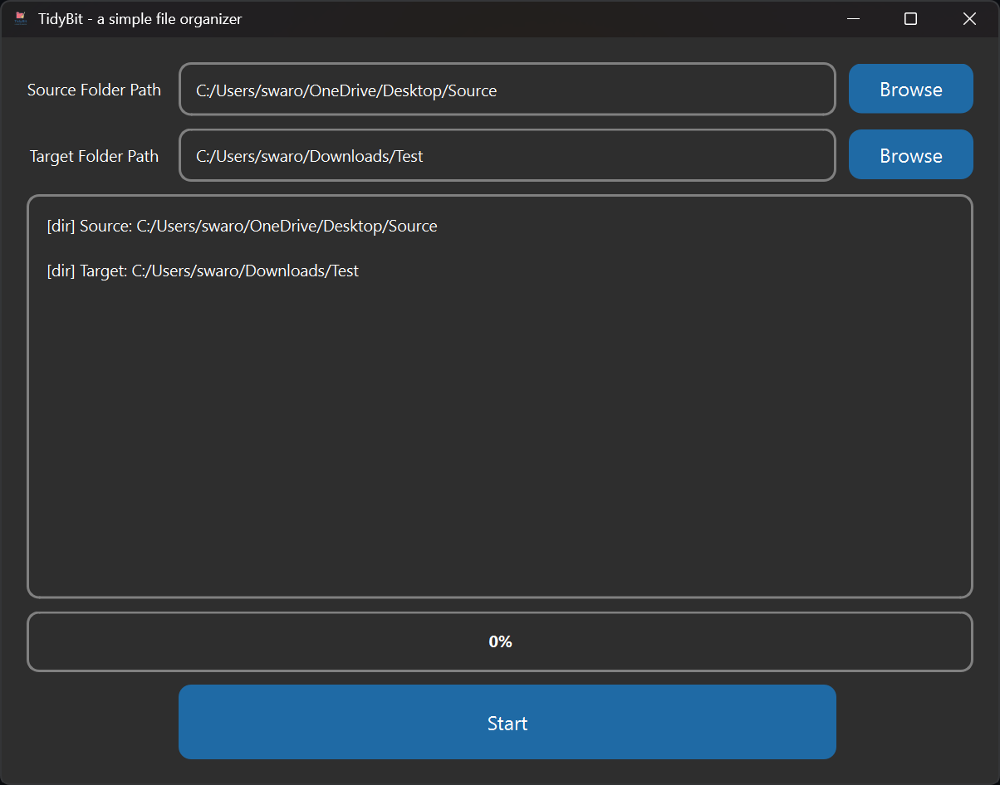
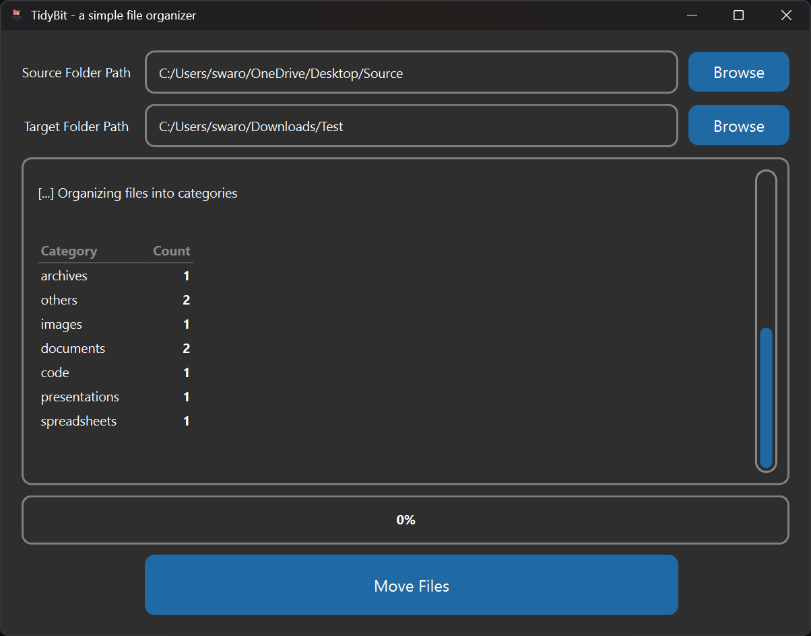

<p align="center">
  
</p>

# TidyBit - a simple file organizer


## 📹 Video Demo:  [Watch the demo on YouTube](https://youtu.be/85Ts99_okq0?si=d2_2SD-RUv1o51TK)

## 📥 Download
**[Download the latest version here](https://github.com/Veda-Swaroop/TidyBit/releases/tag/v1.2.0)**

### 🪟 Windows Instructions
1. Download the `.exe` setup file.
2. Run the installer and follow the steps.

### 🐧 Linux Instructions
1. Download the `.AppImage` file.
2. Right-click the file -> Properties -> Permissions.
3. Check **"Allow executing file as program"**.
4. Double-click to run!

**Note**: If unable to run app on Linux, It might be due to **FUSE (Filesystem in Userspace) version**.
Latest Ubuntu, Debian and other Linux distros may require FUSE installation.
Please check this page for instructions:[AppImage - FUSE] (https://github.com/AppImage/AppImageKit/wiki/FUSE)

## 📷 Screenshots:

<p align="center">
  
  
</p>
<p align="center">
  
  
</p>
<p align="center">
  
  
</p>

## 📝 Description: TidyBit is a simple handy tool that can organize messy collection of files and move them to a chosen folder. 
**Note**: 
1. The program works with only files and not with sub-directories or other folders. So if there are any such sub-directories or other folders, it will simply ignore them. 
2. Please check **file_ext.py** file to see the file-extensions this tools identifies.


## 📖 Introduction

Our computers often become cluttered with files scattered across Downloads, Desktop, or external drives. Manually sorting them is tedious and time‑consuming. **TidyBit** was built to solve this problem with a clean, beginner‑friendly interface.

This lightweight Python tool helps you organize files in just four simple steps:
1. **Validation** – Check source and target folder paths  
2. **Fetch Files** – Display files from the source folder  
3. **Organize Files** – Categorize files by extension (documents, images, videos, code, etc.)  
4. **Move Files** – Create subfolders and move files accordingly  

With its simple GUI and clear logbox feedback, TidyBit makes file organization effortless and efficient.


## ✨ Features
- Organizes files by category (documents, images, videos, audio, code, archives, etc.)
- Simple GUI with logbox feedback
- Step-by-step workflow:
  1. Validation
  2. Fetching Files
  3. Organizing Files
  4. Moving Files
- Supports most common file extensions
- Clear error handling and user messages

## ⚙️ Installation (Running from Source)
If you are a developer or want to run the Python script directly:

1. Clone the repository:
   ```bash
   https://github.com/Veda-Swaroop/TidyBit.git
   pip install -r requirements.txt
   python main.py

## 🚀 Usage

Using **TidyBit** is straightforward. The interface guides you through four clear steps:

1. **Select Folders**  
   - Choose a **source folder** (where cluttered files are located).  
   - Choose a **target folder** (where organized files will be moved).  

2. **Validate Paths**  
   - Click **Start** to confirm both folder paths.  
   - If there are issues, TidyBit alerts you with a message window.  

3. **Fetch Files**  
   - Display all files from the source folder in the logbox.  
   - Verify the list before proceeding.  

4. **Organize & Move**  
   - Files are categorized by extension (documents, images, videos, audio, code, archives, etc.).  
   - Subfolders are created in the target directory.  
   - Files are moved into their respective categories with clear logbox feedback.  

📷 The screenshots above illustrate each step in action.


## 🛠️ Roadmap

TidyBit is just getting started! Here are some planned improvements and future directions:

- [x] **Cross‑platform support** – Extend compatibility to Linux  
- [x] **Executable packaging** – Distribute as a standalone app for easy installation 
- [x] **Progress Bar** - Progress Bar in UI
- [x] **New UI framework** - Migrated from Custom Tkinter to PySide6 UI framework
- [x] **Handling duplicate files** - Rename automatically for duplicate filenames
- [x] **Enhanced error handling** – More detailed logs and clearer user feedback
- [x] **Performance optimization** – Handle larger folders and thousands of files more efficiently  
- [ ] **Expanded file categories** – Support additional extensions and niche file types   
- [ ] **Community contributions** – Encourage plugins or custom categorization rules  

## 🤝 Contributing
Contributions, issues, and feature requests are welcome!
Feel free to open an issue or submit a pull request.

## 📜 License

This project is licensed under the [MIT License](LICENSE).  
You are free to use, modify, and distribute this software, provided that proper credit is given.
